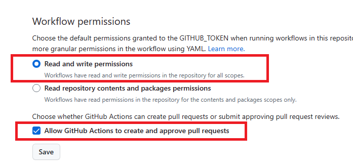

# GitHub Action for Bandit

This GitHub Action runs [Bandit](https://bandit.readthedocs.io/en/latest/), a 
tool designed to find common security issues in Python code, against a Python 
codebase.

## Features

- :gear: Supports full custom Bandit configuration and profile.
- :speech_balloon: Posts scan results as a comment on pull requests.

## Inputs

| Name                 | Description                                                 | Default |
|----------------------|-------------------------------------------------------------|---------|
| `recursive`          | Find and process files in subdirectories.                   | `false` |
| `aggregate`          | Aggregate output by vulnerability or by filename.           | `vuln`  |
| `context_lines`      | Maximum number of code lines to output for each issue.      |         |
| `config_file`        | Optional config file to use for selecting plugins.          |         |
| `profile`            | Profile to use, defaults to executing all tests.            |         |
| `tests`              | Comma-separated list of test IDs to run.                    |         |
| `skips`              | Comma-separated list of test IDs to skip.                   |         |
| `severity_level`     | Report only issues of a given severity level or higher.     | `low`   |
| `confidence_level`   | Report only issues of a given confidence level or higher.   | `low`   |
| `verbose`            | Output extra information like excluded and included files.  | `false` |
| `debug`              | Turn on debug mode.                                         | `false` |
| `quiet`              | Only show output in the case of an error.                   | `false` |
| `ignore_nosec`       | Do not skip lines with `# nosec` comments.                  | `false` |
| `exclude_paths`      | Comma-separated list of paths to exclude from scan.         |         |
| `baseline`           | Path of a baseline report to compare against.               |         |
| `ini_path`           | Path to a `.bandit` file that supplies command line args.   |         |
| `exit_zero`          | Exit with 0 even with results found.     

## Usage

To use the action, add the following to your GitHub workflow file (e.g. `.github/workflows/bandit.yml`:

### Basic Example

```yaml
name: Bandit Code Scan

on:
  pull_request:
    branches: [ main ]

jobs:
  bandit-action:
    runs-on: ubuntu-latest
    steps:
    - uses: actions/checkout@v2
    - name: Run Bandit Scan
      uses: ./
      env:
        GITHUB_TOKEN: ${{ secrets.GITHUB_TOKEN }}
      with:
        path: "."
        exit_zero: "true"
        recursive: "true"
```

```yaml
name: Bandit Code Scan

on: [push, pull_request]

jobs:
  bandit-action:
    runs-on: ubuntu-latest
    steps:
    - uses: actions/checkout@v2
    - name: Run Bandit Scan
      uses: ./
      env:
        GITHUB_TOKEN: ${{ secrets.GITHUB_TOKEN }}
      with:
        path: "."
        exit_zero: true
        recursive: true
        aggregate: vuln
        context_lines: 3
        config_file: .bandit
        profile: bandit
        tests: B101,B102
        skips: B101
        severity_level: low
        confidence_level: low
        verbose: true
        debug: true
        quiet: false
        ignore_nosec: false
        exclude_paths: tests,docs
        baseline: baseline.json
        ini_path: .bandit
        exit_zero: false
```

## Enable Workflow Permissions

This action requires the need to post an issue to the repository. To enable this,
you will need to set up the Workflow Permissions under your repository settings.



## Contributing

If you would like to contribute to this project, please open an issue or a pull request.

## License

This GitHub Action is distributed under the Apache License, Version 2.0, see [LICENSE](LICENSE) for more information.
